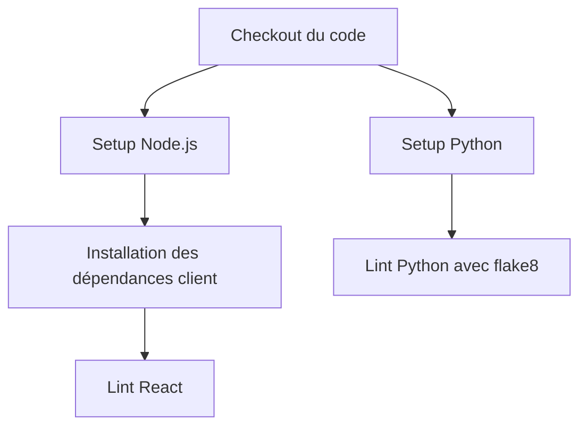
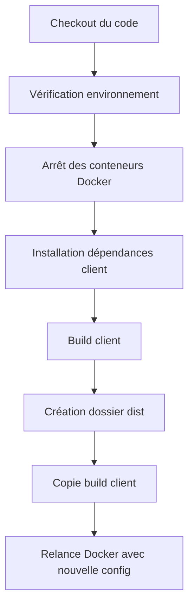

# Documentation CI/CD Cabestan

## Vue d'ensemble

Le projet utilise GitHub Actions pour l'intégration continue (CI) et le déploiement continu (CD). Deux workflows principaux sont définis :
1. Vérification de la qualité du code (`check_lint.yml`)
2. Déploiement en staging (`deploy_staging.yml`)

## Workflows

### 1. Vérification du Code (check_lint.yml)

**Déclencheur** : 
- Pull Request (ouverture, réouverture, synchronisation)

**Étapes** :


**Configuration flake8** :
- Ignore : E302, E203, F401, W503
- Longueur maximale de ligne : 150 caractères
- Exclusion : dossier client

### 2. Déploiement Staging (deploy_staging.yml)

**Déclencheur** :
- Push sur la branche `develop`


**Variables d'environnement** :
```yaml
COMPOSE_PROJECT_NAME: Nom du projet
DJANGO_SUPERUSER_*: Credentials superutilisateur
DB_*: Configuration base de données
CERTIFICATES_PATH: Chemin des certificats SSL
VITE_*: Configuration client React
```

**Étapes de déploiement** :


**Spécificités** :
- Runner : self-hosted, staging, cabestan
- Environnement : staging
- Utilisation de docker-compose.staging.yml
- Build et déploiement du client React
- Redémarrage complet des conteneurs


## Sécurité

1. **Variables sensibles** :
   - Stockées dans GitHub Secrets
   - Injectées via les variables d'environnement

2. **SSL/TLS** :
   - Certificats Let's Encrypt
   - Configuration HTTPS

3. **Environnements** :
   - Séparation staging/production
   - Variables spécifiques par environnement
