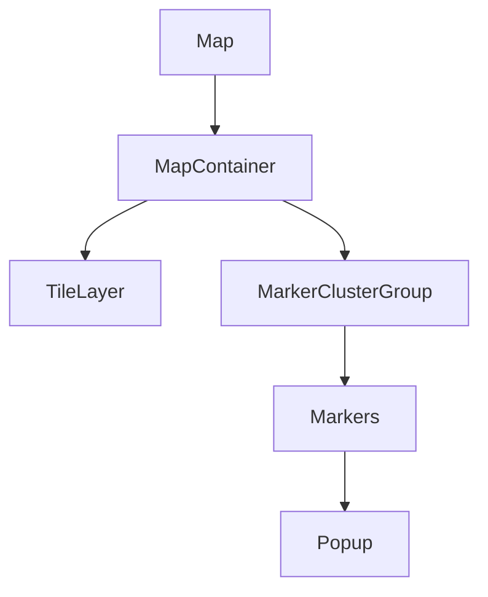

# Documentation Client Frontend Cabestan

## Vue d'ensemble

Le client frontend de Cabestan est une application React moderne utilisant :
- Vite comme bundler
- TypeScript pour le typage
- TailwindCSS pour le styling
- Shadcn/ui pour les composants
- React Query pour la gestion des données
- i18next pour l'internationalisation

## Architecture

```
client/
├── src/
│   ├── api/           # Appels API
│   ├── assets/        # Images et SVG
│   ├── components/    # Composants React
│   ├── hooks/        # Hooks personnalisés
│   ├── i18n/         # Traductions
│   ├── lib/          # Utilitaires
│   ├── models/       # Types TypeScript
│   └── pages/        # Pages de l'application
```

## Composants Principaux

### 1. Carte Interactive (Map)


**Fonctionnalités** :
- Affichage des établissements sur une carte
- Clustering des marqueurs
- Popups d'information
- Export PDF
- Reset du zoom

### 2. Graphique à Barres (BarsChart)
- Visualisation des données statistiques
- Export PDF
- Affichage/masquage dynamique

### 3. Liste des RCR (RCRList)
- Liste paginée des établissements
- Détails des établissements
- Export CSV
- Filtrage

## Système de Recherche

### SearchBar
```typescript
interface SearchBarProps {
  filters: {
    languages: string[]
    regions: string[]
    departments: string[]
    types: string[]
  }
}
```

**Filtres disponibles** :
1. Langues
2. Régions
3. Départements
4. Types d'établissements

## Gestion des Données

### 1. API Client
```typescript
const API_CONFIG = {
  HOST: import.meta.env.VITE_API_HOST,
  PROTOCOL: import.meta.env.VITE_API_PROTOCOL,
  PATH: import.meta.env.VITE_API_PATH
}
```

### 2. React Query
- Mise en cache des données
- Revalidation automatique
- Gestion des erreurs
- Pagination optimisée

## Internationalisation

Utilisation de i18next pour :
- Support multilingue
- Traductions dynamiques
- Formatage des nombres
- Messages d'erreur

## Styles et Thème

### 1. TailwindCSS
- Classes utilitaires
- Responsive design
- Thème personnalisé
- Dark mode support

### 2. Shadcn/ui
- Composants accessibles
- Personnalisables
- Cohérents

## Performance

### Optimisations
1. **Code Splitting**
   - Chargement à la demande
   - Bundle optimisé

2. **Caching**
   - Cache React Query
   - Mise en cache des assets

3. **Images**
   - Optimisation automatique
   - Lazy loading

## Déploiement

### Production Build
```bash
npm run build
```

### Configuration Docker
```yaml
client:
  build:
    context: ./client
    dockerfile: Dockerfile
  environment:
    - NODE_ENV=production
    - VITE_API_HOST=${HOST}
    - VITE_API_PROTOCOL=https
    - VITE_API_PATH=/api/rest
```

## Tests et Qualité

### 1. Linting
- ESLint pour TypeScript/React
- Prettier pour le formatage
- Règles personnalisées

### 2. TypeScript
- Types stricts
- Interfaces pour les modèles
- Vérification statique

## Bonnes Pratiques

1. **Composants**
   - Composants fonctionnels
   - Props typées
   - Séparation des responsabilités

2. **État**
   - Gestion locale avec useState
   - Cache global avec React Query
   - URL comme source de vérité

3. **Performance**
   - Mémoisation avec useMemo/useCallback
   - Pagination côté serveur
   - Lazy loading des composants

## Maintenance

1. **Mises à jour**
   - Dépendances npm
   - Types TypeScript
   - Composants Shadcn

2. **Monitoring**
   - Erreurs React Query
   - Performance des composants
   - Temps de chargement

3. **Documentation**
   - Types et interfaces
   - Composants réutilisables
   - Configuration