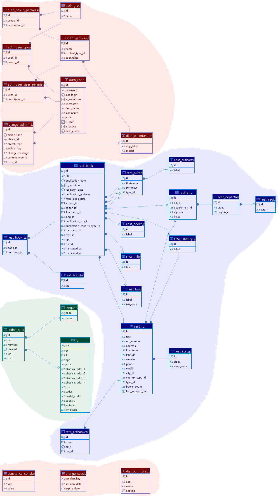

## Modèle Conceptuel de Données

  

## Structure de la Base de Données

### Localisation

#### Region
- **id** : Identifiant unique
- **label** : Nom de la région (max 100 caractères)

#### Department
- **id** : Identifiant unique
- **label** : Nom du département (max 100 caractères)
- **region_id** : Clé étrangère vers Region (nullable)

#### City
- **id** : Identifiant unique
- **label** : Nom de la ville (max 100 caractères)
- **zipcode** : Code postal (max 10 caractères, nullable)
- **insee** : Code INSEE (max 10 caractères, nullable)
- **department_id** : Clé étrangère vers Department

#### CountryType
- **id** : Identifiant unique
- **label** : Type de territoire (DROM, Metropolitan, Stranger)

### RCR (Répertoire des Centres de Ressources)

#### RcrType
- **id** : Identifiant unique
- **label** : Type d'établissement (max 100 caractères)
- **abes_code** : Code ABES (max 10 caractères, nullable)
- Index : Hash sur label

#### Rcr
- **id** : Identifiant unique
- **title** : Nom de l'établissement (max 200 caractères)
- **rcr_number** : Numéro RCR (max 50 caractères)
- **type_id** : Clé étrangère vers RcrType
- **city_id** : Clé étrangère vers City (nullable)
- **address** : Adresse (max 255 caractères)
- **longitude** : Coordonnée géographique (nullable)
- **latitude** : Coordonnée géographique (nullable)
- **website** : Site web (nullable)
- **phone** : Téléphone (max 20 caractères, nullable)
- **email** : Email (nullable)
- **country_type_id** : Clé étrangère vers CountryType
- **books_count** : Nombre de livres (nullable, défaut 0)
- **last_scraped_date** : Date dernière mise à jour (nullable, auto)
- Index : Hash sur rcr_number et title

### Livres

#### Lang
- **id** : Identifiant unique
- **label** : Nom de la langue (max 100 caractères)
- **iso_code** : Code ISO de la langue (max 10 caractères)

#### AuthorType
- **id** : Identifiant unique
- **label** : Type d'auteur (author, editor, illustrator, etc.)

#### Author
- **id** : Identifiant unique
- **firstname** : Prénom (max 100 caractères, nullable)
- **lastname** : Nom (max 100 caractères)
- **type_id** : Clé étrangère vers AuthorType
- Index : Hash sur firstname et lastname
- Contrainte : Unicité sur (firstname, lastname, type)

#### Editor
- **id** : Identifiant unique
- **title** : Nom de l'éditeur (max 200 caractères, unique)
- Index : Hash sur title

#### BookType
- **id** : Identifiant unique
- **label** : Type de document (book, pdf, etc.)
- Index : Hash sur label

#### BookTags
- **id** : Identifiant unique
- **tag** : Tag (unique, nullable)
- Index : Hash sur tag

#### Book
- **id** : Identifiant unique
- **ppn** : Identifiant PPN (max 200 caractères, unique)
- **title** : Titre (max 200 caractères, nullable)
- **lang_id** : Clé étrangère vers Lang (nullable)
- **type_id** : Clé étrangère vers BookType (nullable)
- **editor_id** : Clé étrangère vers Editor (nullable)
- **publication_date** : Date de publication (nullable)
- **is_reedition** : Booléen réédition (nullable)
- **reedition_date** : Date de réédition (nullable)
- **author_id** : Clé étrangère vers Author (nullable)
- **illustrator_id** : Clé étrangère vers Author (nullable)
- **translator_id** : Clé étrangère vers Author (nullable)
- **publication_city_id** : Clé étrangère vers City (nullable)
- **publication_address** : Adresse de publication (max 255 caractères, nullable)
- **publication_country_type_id** : Clé étrangère vers CountryType (nullable)
- **misc_book_data** : Données diverses en JSON (nullable)
- **translated_of** : Titre original (nullable)
- **translated_as** : Titre traduit (nullable)
- **rcr_id** : Clé étrangère vers Rcr
- **tags** : Relation ManyToMany vers BookTags
- Index : Hash sur title

#### RcrBookCount
- **id** : Identifiant unique
- **rcr_id** : Clé étrangère vers Rcr
- **count** : Nombre de livres (défaut 0)
- **date** : Date du comptage (nullable)

## Relations principales

1. Un RCR appartient à une ville et un type de territoire
2. Un livre appartient à un RCR et peut avoir :
   - Un auteur
   - Un traducteur
   - Un illustrateur
   - Un éditeur
   - Une ville de publication
   - Une langue
   - Plusieurs tags
3. Une ville appartient à un département qui appartient à une région