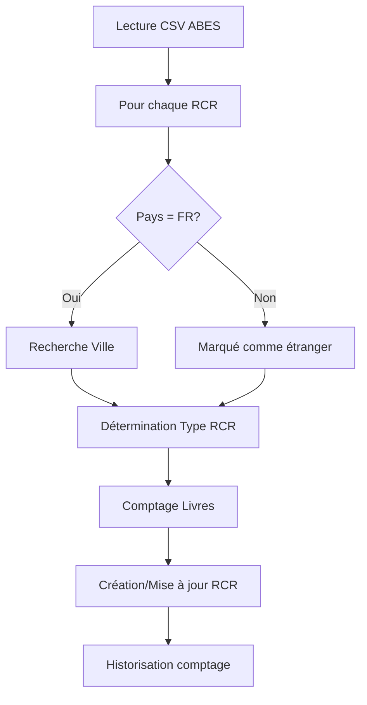
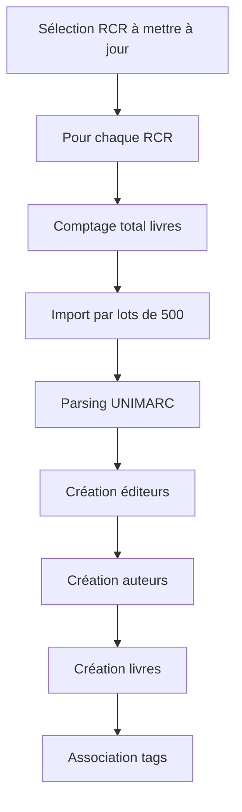

# Documentation des Scrapers Cabestan

## Vue d'ensemble

Cabestan utilise deux scrapers principaux pour collecter les données :
1. **RCR Scraper** : Collecte les informations sur les établissements
2. **Book Scraper** : Collecte les informations sur les livres de chaque établissement

Ces scrapers sont exécutés dans des conteneurs Docker dédiés en environnement de staging.


## 1. RCR Scraper (scrape_rcr.py)

### Objectif
Collecter les informations sur les établissements (RCR) depuis l'API ABES.

### Fonctionnalités
- Import des données RCR depuis une URL configurable
- Géocodage des établissements
- Association avec les villes françaises
- Calcul du nombre de livres par établissement
- Historisation des comptages

### Processus


### Algorithme de recherche de ville
1. Recherche par code postal et INSEE
2. Recherche exacte par nom
3. Recherche partielle par nom
4. Recherche avec nom normalisé
5. Recherche avec remplacement "Saint" par "St"

## 2. Book Scraper (scrape_book.py)

### Objectif
Collecter les informations sur les livres de chaque établissement.

### Fonctionnalités
- Import des livres par lots de 500
- Parsing du format UNIMARC
- Gestion des auteurs, traducteurs et illustrateurs
- Association des tags et métadonnées
- Mise à jour incrémentale (7 jours)

### Processus


### Optimisations
1. **Création en masse** :
   - Bulk create pour les éditeurs
   - Bulk create pour les auteurs
   - Bulk create pour les livres

2. **Dédoublonnage** :
   - Vérification des éditeurs existants
   - Vérification des auteurs existants
   - Mise à jour des livres existants

3. **Performance** :
   - Chargement initial des données de référence
   - Utilisation de mappings en mémoire
   - Gestion des conflits en base

## Parser UNIMARC (book_parser.py)

### Objectif
Parser les données UNIMARC en format exploitable.

### Fonctionnalités
- Reconstruction du XML
- Extraction des champs UNIMARC
- Normalisation des données
- Gestion des traductions

### Champs principaux
```python
{
    "ppn": "Identifiant unique",
    "title": "Titre du livre",
    "lang": {"iso_code": "Code ISO", "label": "Nom langue"},
    "type": "Type de document",
    "editor": {"title": "Nom éditeur"},
    "author": {
        "firstname": "Prénom",
        "lastname": "Nom",
        "type": "Type d'auteur"
    }
}
```

## Exécution en Production
La configuration du crontab se fait dans les fichiers `app/scraper_cron_book` et `app/scraper_cron_rcr`.

### Monitoring
- Logs dans Docker
- Historisation des comptages
- Dates de dernière mise à jour
- Statistiques de performance

1. **Limitations API** :
   - Maximum 500 résultats par appel
   - Temps de réponse variable
   - Nécessité de pagination
